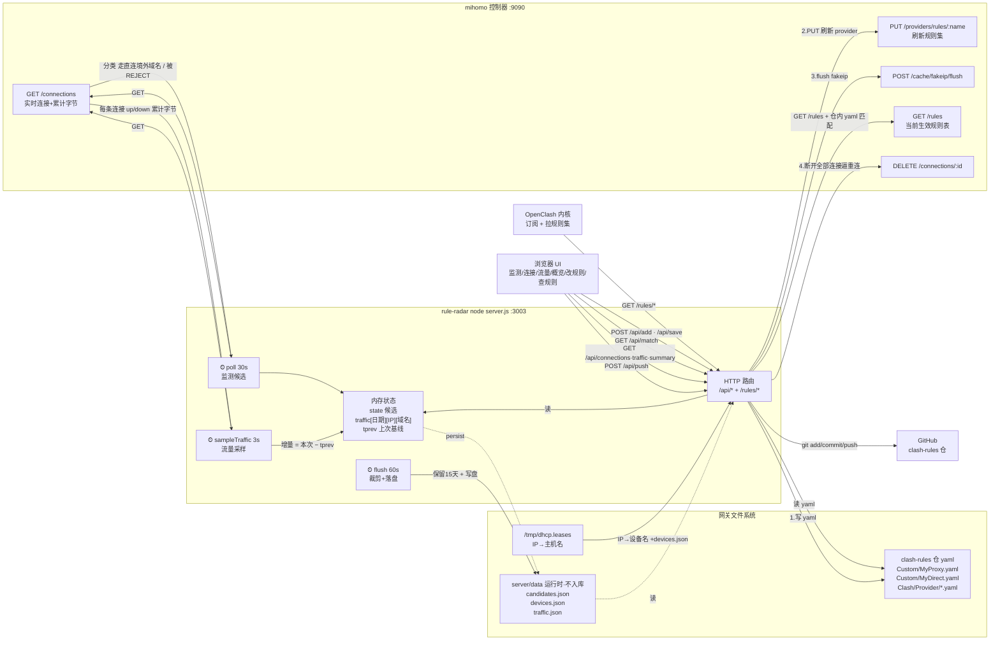

# rule-radar 运行原理与数据流

> 📐 可视化图见同目录 `architecture.excalidraw`（用 Excalidraw / Obsidian Excalidraw 插件打开、可编辑）。下文 Mermaid 图与文字为同一内容的文本版。

> 单进程纯 Node 服务（`server.js`，无依赖），跑在网关 iStoreOS 的 docker 容器里（host 网络，`:3003`）。
> 把整个 `clash-rules` 仓挂进容器 `/repo`。核心 = **3 个定时器 + 1 个 HTTP 服务**，全部围着 mihomo 控制器（`:9090`）转。

## 组件与数据流总图

## 五条数据流详解

### ① 监测候选（`poll`，每 30s）
拉 `/connections`，对每条连接分类：`chains` 含 `REJECT` → **被拦**；`rule` 为 `MATCH` → **未覆盖（走了直连的境外域名）**。按域名累计命中次数存内存 `state`，落盘 `candidates.json`。网页「监测候选」展示，一键加规则。

### ② 流量采样（`sampleTraffic`，每 3s）
内核不持久化历史流量（连接断开即消失、重连从 0 起）。所以记下每条连接上次累计值 `tprev`，本次算**增量**累加进 `traffic[北京日期][来源IP][域名] = {up,down,rule,dir}`。
- 首轮只建基线（避免把建连前的历史累计一次性计入）；
- 新连接（含重连）整笔计入当前值（短连接也不漏）；
- 出口类别 `dir` 由 `chains[0]` 判定：`DIRECT`→直连、`REJECT`→拦截、其它→代理；
- `flush`（每 60s）裁剪到保留 15 天并写 `traffic.json`。
- 网页「流量统计」「统计概览」展示，来源 IP 经 DHCP 租约（+`devices.json` 覆盖）解析成设备名。

### ③ 本地 serve 规则集（`GET /rules/*`）
OpenClash 的 rule-providers 指向 `http://网关:3003/rules/<path>`，rule-radar 直接读仓内 yaml 返回。规则集托管在局域网，避免走 jsdelivr（网关连它常 TLS 超时）。

### ④ 改规则即时生效（`POST /api/add` · `/api/save`）
这是核心闭环，四步连做：**写 yaml → `PUT` 刷新对应 provider → `flush` fake-ip 缓存 → `DELETE` 断开全部连接**。
> 关键：mihomo 只在**建连那一刻**匹配一次规则，存量连接不会重新匹配。所以必须断开旧连接逼其重连，新规则才立刻生效。

### ⑤ 查规则（`GET /api/match`）
输入域名（自动清洗协议头/路径/端口），拉 `/rules` 拿当前生效规则表，再到仓内对应 yaml 文件里逐条匹配，给出「命中哪个规则集、走哪个出口组」，并可在结果区直接强制代理/直连覆盖。

## 进程结构（一句话）
`server.js` 启动后：`http.createServer` 监听 `:3003` 处理所有 `/api/*` 与 `/rules/*`；同时挂 3 个 `setInterval`（监测 30s、采样 3s、落盘 60s）。所有状态在内存，定期落盘到 `server/data/`（运行时数据，已 gitignore）。无热重载，改代码需 `docker compose restart`。
